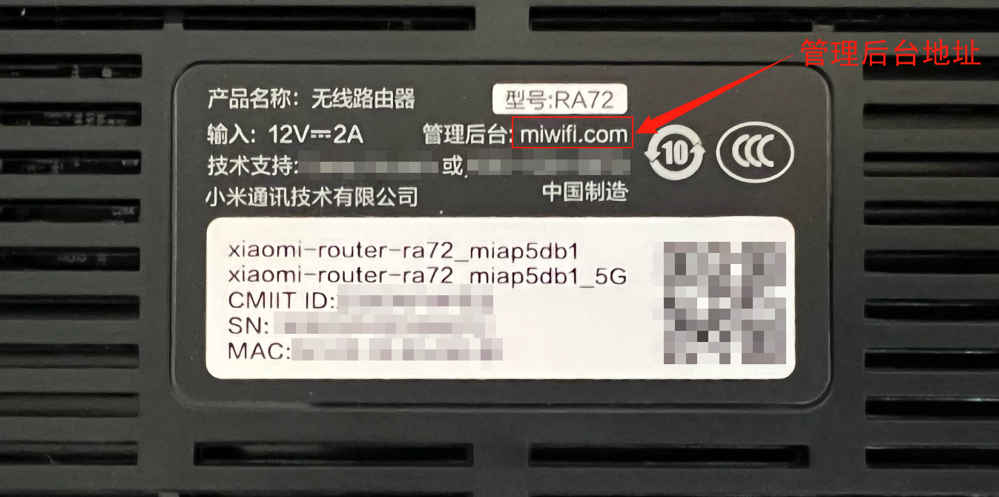
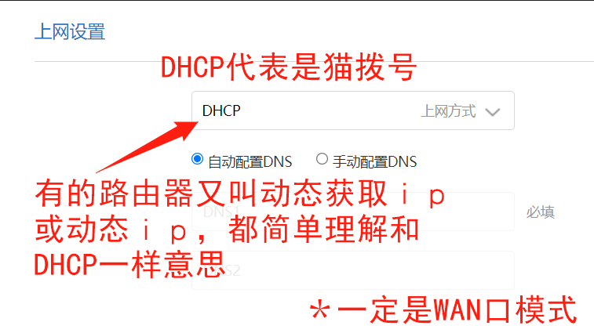

# 1.1 确定家中网络拨号类型

> 首先一定要确认家中宽带上网方式！\
> **温馨提示：不是家中有了光猫或者路由器，就是光猫拨号或者路由器拨号哈！**\
> PS：请按如下方式判断家中宽带上网方式！！！

**如何判断是光猫拨号还是路由器拨号：**

* [x] <mark style="color:blue;">**方法一：**</mark>

①首先，查看无线路由器机器背部管理登录地址（图示小米ax6000）；

<figure><figcaption>
<mark style="color:red;"><strong>小米AX6000机器背部图贴</strong></mark>
</figcaption></figure>

②电脑浏览器登录无线路由器管理后台，按图文确认上网方式（图示小米ax6000后台）（每个品牌路由器界面不同，具体如何找到上网方式在哪里，百度对应路由器型号即可）

<figure><figcaption>
<mark style="color:red;"><strong>光猫拨号</strong></mark>
</figcaption></figure>

 

<figure><figcaption>
<mark style="color:red;"><strong>路由器拨号</strong></mark>
</figcaption></figure>

* [x] <mark style="color:blue;">**方法二**</mark>

①光猫千兆网口（或网口1）直接连接电脑（电脑网络为自动获取）； ②电脑有线可以上网，能打开百度，则是『光猫拨号』； ③电脑有线不能上网，打不开百度，则是『路由器拨号』。


以上只是初步判断，最好可以致电运营商客服确认！！

