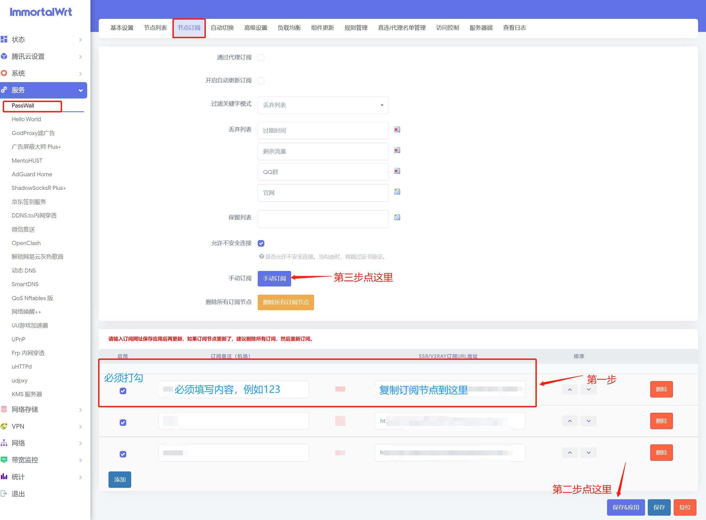
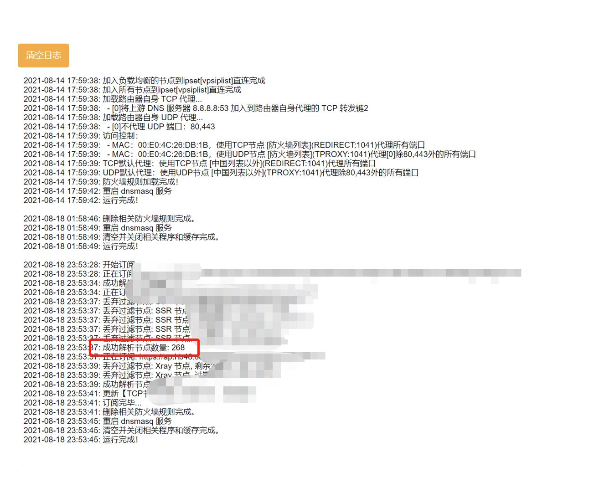
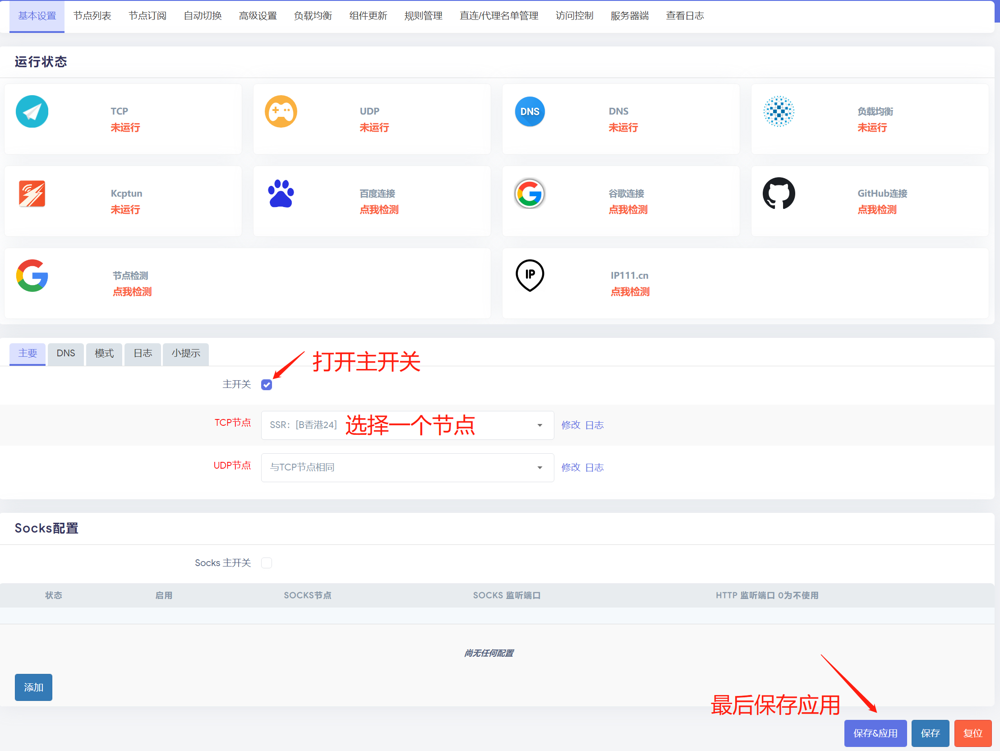

# 4.1  Passwall的图文教程


### 使用机场订阅链接


```
进入后台后点左侧--服务→passwall，然后点上方节点订阅，按下图操作
```



```
出现下图中红框中的文字表示订阅节点成功。
```



```
订阅成功以后点击上方菜单--基本设置，然后按照下图操作
```



> **done!**

****


### 自己搭建的VPS 单节点添加


```
进入后台后点左侧--服务→passwall，然后点上方节点列表，按下图操作
```

.jpg>)

.jpg>)

```
添加成功以后点击上方菜单--基本设置，然后按照下图操作
```

.jpg>)

> ****\
> **done!**


