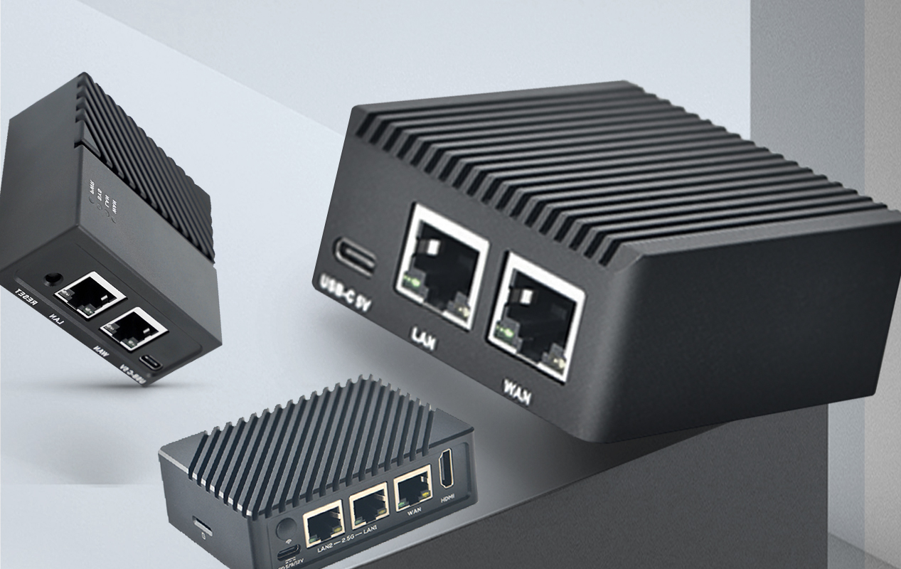

# ARM软路由

<figure><figcaption></figcaption></figure>

## [友善官方WIKI](https://wiki.friendlyarm.com/wiki/index.php/Main\_Page)

* [R2S](https://wiki.friendlyarm.com/wiki/index.php/NanoPi\_R2S)
* [R4S](https://wiki.friendlyarm.com/wiki/index.php/NanoPi\_R4S)
* [R4SE](https://wiki.friendlyelec.com/wiki/index.php/NanoPi\_R4SE)
* [R5S](https://wiki.friendlyelec.com/wiki/index.php/NanoPi\_R5S/zh)
